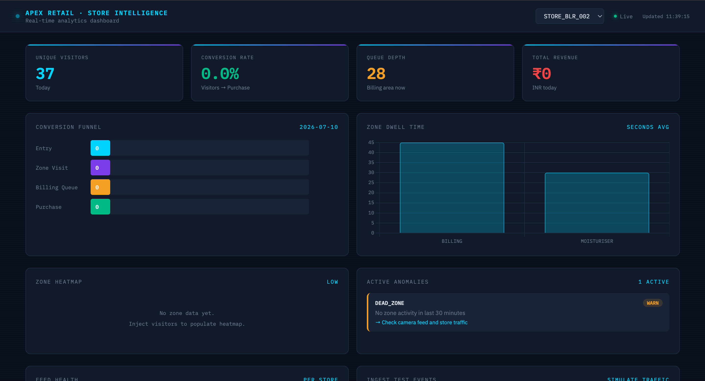
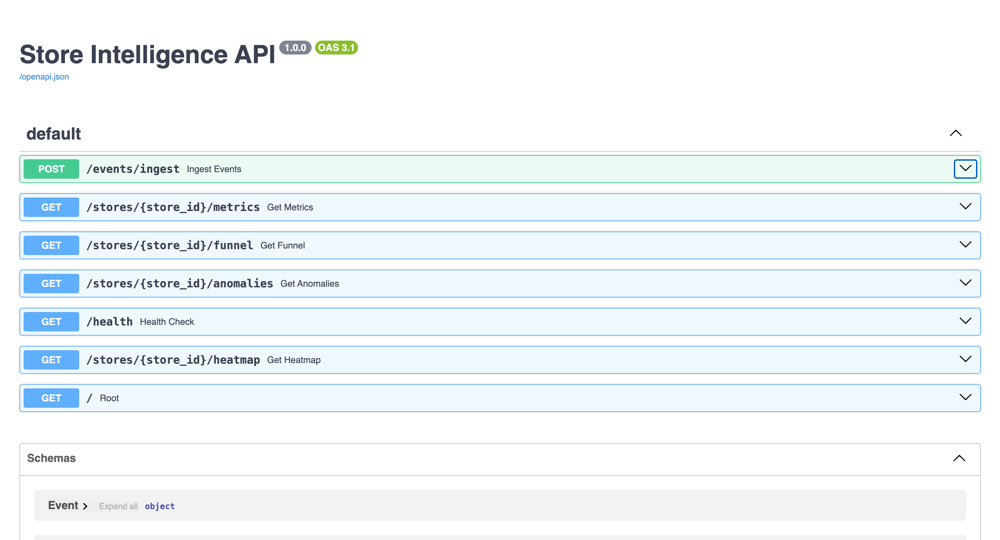
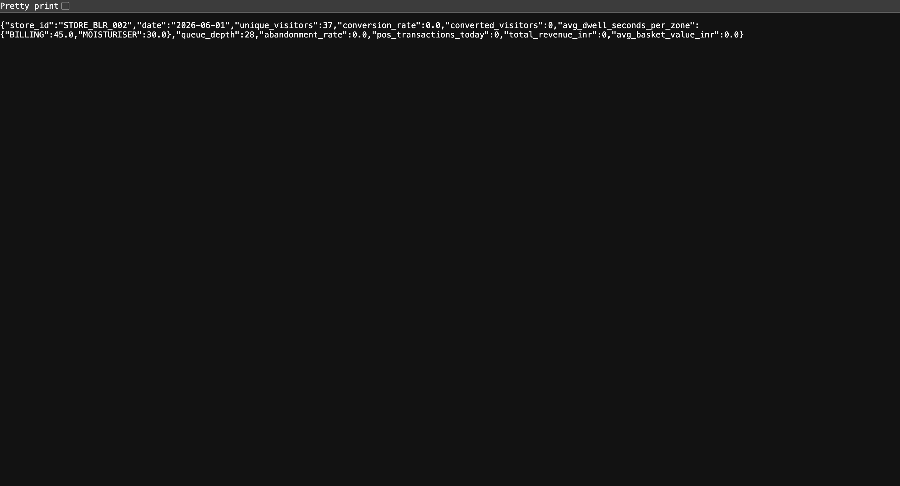

# Store Intelligence API

A system that watches store CCTV footage and tells you how many customers visited, where they went, and whether they bought anything — all in real time.


---

## Live Links

- **Dashboard** → https://promal7.github.io/store-intelligence/
- **API** → https://store-intelligence-9epo.onrender.com/docs

> The API runs on a free server that sleeps when inactive. If the dashboard shows "API unreachable", open the API link above, wait 30 seconds, then refresh the dashboard.

---

## Screenshots

### Dashboard


### API


### Metrics Response


---

## What It Does

1. **Detects people** in CCTV footage using YOLOv8
2. **Tracks movement** across zones (Entry, Skincare, Moisturiser, Billing etc.)
3. **Emits events** like ENTRY, EXIT, ZONE_DWELL, BILLING_QUEUE_JOIN
4. **Stores everything** in a database via a REST API
5. **Shows live metrics** on a web dashboard — visitor count, conversion rate, queue depth, anomalies

---

## How to Run

```bash
git clone https://github.com/promal7/store-intelligence
cd store-intelligence
docker compose up --build
```

Open http://localhost:8000/docs

## Run Detection on Your Own Clips

```bash
python3.12 pipeline/detect.py --input data/clips/ --output data/events/events.jsonl
python3.12 pipeline/emit.py
```

---

## API Endpoints

| Endpoint | What It Returns |
|---|---|
| `POST /events/ingest` | Add events to the database |
| `GET /stores/{id}/metrics` | Visitor count, conversion rate, dwell time |
| `GET /stores/{id}/funnel` | How many people went from entry to purchase |
| `GET /stores/{id}/heatmap` | Which zones got the most traffic |
| `GET /stores/{id}/anomalies` | Queue spikes, dead zones, conversion drops |
| `GET /health` | Is the API working? |

---

## Tech Used

- **YOLOv8 + ByteTrack** — person detection and tracking
- **FastAPI + SQLite** — backend API and database
- **Docker** — runs everything in one command
- **GitHub Pages** — hosts the dashboard
- **Render** — hosts the live API

---

## Tests

```bash
python3.12 -m pytest tests/ -v
# 9/9 tests passing
```

---

